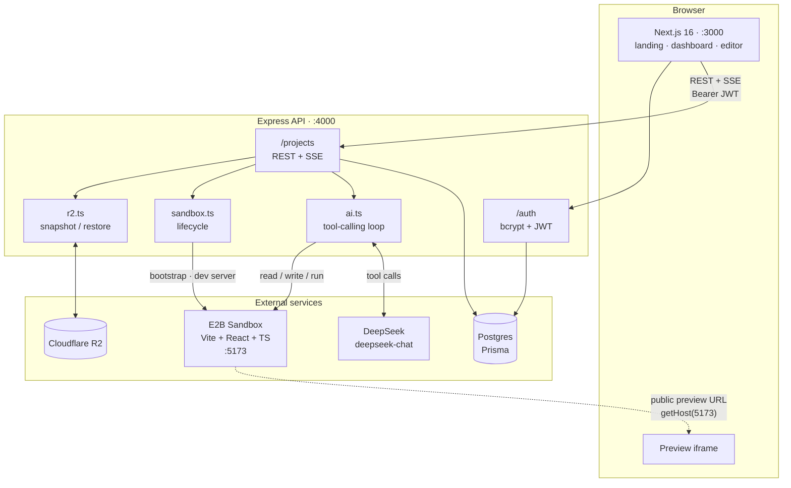

# Volt

Describe an app in plain English. Volt writes the code, runs it in an isolated cloud sandbox, and streams a live preview back to your browser.

A Lovable/Bolt-style "chat to app" builder. Each project gets its own [E2B](https://e2b.dev) sandbox running a Vite + React + TypeScript dev server; an LLM edits files inside it through tool calls, Vite's HMR picks up the changes, and the result renders in an iframe.

## Stack

| Layer | Choice | Notes |
|---|---|---|
| Monorepo | Turborepo + pnpm workspaces | `pnpm@11.0.3`, Node >= 20 |
| Frontend | Next.js 16, Tailwind v4, shadcn/ui | port **3000** |
| Backend | Express + TypeScript | port **4000** |
| LLM | DeepSeek `deepseek-chat` | via the OpenAI SDK against `api.deepseek.com` |
| Sandboxing | E2B | one sandbox per project, Vite on port **5173** |
| Database | Postgres via Prisma | |
| Object storage | Cloudflare R2 (S3-compatible) | source snapshots |

> **Next.js 16 note:** Middleware was renamed to **Proxy**. Auth routing lives in `apps/web/proxy.ts`, not `middleware.ts`.

## Architecture



The browser talks only to the Express API. It never holds sandbox credentials, DeepSeek keys, or R2 keys — the only sandbox detail that reaches the client is the public preview URL.

## Repository layout

```
apps/
  web/                     Next.js frontend
    app/
      page.tsx             Landing page — prompt box, auth modal
      dashboard/           Project list, create + delete
      project/[projectId]/ Editor: chat sidebar, Preview/Code tabs
      (auth)/signin|signup Standalone auth pages
    lib/
      auth.ts              Session (cookie is the source of truth)
      token.ts             Runtime-agnostic JWT decode (client + proxy)
      api.ts               Fetch wrapper, attaches Bearer token
    proxy.ts               Next 16 Proxy — optimistic auth routing

  backend/                 Express API
    src/
      index.ts             App entry, CORS, route mounting
      routes/auth.ts       Signup / signin
      routes/project.ts    Project CRUD, files, sandbox, SSE messages
      lib/ai.ts            DeepSeek tool-calling loop
      lib/sandbox.ts       E2B lifecycle, bootstrap, dev server
      lib/r2.ts            R2 snapshot / restore
      middleware/auth.ts   requireAuth — verifies JWT

packages/
  db/                      Prisma schema, migrations, shared client
  shared-types/            Types shared across apps
```

## The build loop

`POST /projects/:id/messages` holds an SSE connection open for the whole run:

1. Save the user message, then open the stream.
2. Connect to the project's existing E2B sandbox, or create one. A fresh sandbox is bootstrapped with `create-vite` (react-ts) plus Tailwind v3.
3. If the sandbox was replaced, restore the project's source from R2.
4. Start the Vite dev server if it isn't already up, and save `sandboxId` + `previewUrl`.
5. Run the tool-calling loop below, streaming each call to the UI.
6. Save the assistant's summary, snapshot `src/` to R2, and emit `done`.

The model works through three tools until it stops calling them:

| Tool | Arguments | Purpose |
|---|---|---|
| `read_file` | `path` | Read a file from the sandbox |
| `write_file` | `path`, `content` | Create or overwrite a file |
| `run_shell_command` | `command` | Run a shell command (60s timeout) |

Events pushed over SSE:

```ts
| { type: "status"; text: string }
| { type: "tool";   name: string; detail: string }
| { type: "done";   aiText: string; previewUrl: string; messageId?: string }
```

Errors arrive as a terminal `done` event with the message in `aiText`, so failures land in the chat transcript instead of breaking the stream.

The loop is bounded by `MAX_STEPS` (40) and recovers from two failure modes rather than aborting: a response truncated by the model's token ceiling is discarded and retried asking for smaller files, and a tool call whose `arguments` don't parse gets the error fed back as its tool result so the model can correct itself.

## Sandboxes and persistence

Sandboxes are ephemeral (1-hour timeout); **R2 is the durable store**. Every successful run snapshots the project's source, so code survives sandbox death. One object per file, not an archive:

```
projects/{projectId}/src/App.tsx
projects/{projectId}/src/components/Card.tsx
```

The editor polls `GET /projects/:id/sandbox/health` every 30s. When it reports dead, the preview is replaced by a "Sandbox is sleeping" panel whose wake button calls `POST /projects/:id/sandbox/wake` — recreating the sandbox, restoring from R2, and returning a fresh preview URL.

The Code tab reads from R2 rather than the sandbox, so you can browse a project's source even while its sandbox is asleep.

## Authentication

Username + password, bcrypt-hashed (cost 12), issuing a 30-day JWT. There are two checks, deliberately different in strength:

- **`apps/web/proxy.ts`** is an *optimistic* check. It decodes the JWT and checks `exp`, but does **not** verify the signature — `JWT_SECRET` belongs on the backend and must never reach the client bundle or the edge runtime. Next's own docs state that Proxy "should not be used as a full session management or authorization solution." Its only job is to avoid rendering pages you can't use. On rejection it redirects to `/?auth=…&next=…` so the bounce is explainable and resumable.
- **`requireAuth`** on the Express API is the real security boundary, calling `jwt.verify()` with the secret on every project route.

**The cookie is the single source of truth.** The proxy can only read cookies, so a session kept anywhere else would be invisible to it — the UI would show you signed in while every navigation bounced you back to `/`. `getToken()` migrates any legacy `localStorage` token into the cookie once, then removes the copy.

## Data model

Three tables, defined in `packages/db/prisma/schema.prisma`:

- **User** — `id`, unique `username`, bcrypt `password`
- **Project** — `title`, `initialPrompt`, `userId`, plus nullable `sandboxId` and `previewUrl` (rewritten on every run, since a replaced sandbox gets a new host)
- **ConversationHistory** — one row per message: `type` (`TEXT_MESSAGE` / `TOOL_CALL`), `from` (`USER` / `ASSISTANT`), `contents`, `hidden`, optional `toolCall`

## API reference

Base URL: `http://localhost:4000`. Every `/projects` route requires `Authorization: Bearer <jwt>`.

| Method | Path | Purpose |
|---|---|---|
| `GET` | `/health` | Liveness check — `{ ok: true }` |
| `POST` | `/auth/signup` | Create account → `{ token }` |
| `POST` | `/auth/signin` | Sign in → `{ token }` |
| `POST` | `/projects` | Create project from `{ title, initialPrompt }` |
| `GET` | `/projects` | List the caller's projects |
| `GET` | `/projects/:id` | Project + visible conversation history |
| `DELETE` | `/projects/:id` | Delete project, history, and R2 objects |
| `GET` | `/projects/:id/files` | List snapshotted file paths (from R2) |
| `GET` | `/projects/:id/file?path=` | Read one file's contents (from R2) |
| `GET` | `/projects/:id/sandbox/health` | `{ alive: boolean }` |
| `POST` | `/projects/:id/sandbox/wake` | Recreate + restore sandbox → `{ previewUrl }` |
| `POST` | `/projects/:id/messages` | **SSE** — run the build loop |

## Getting started

**Prerequisites:** Node >= 20, pnpm 11 (`corepack enable`), a Postgres database, and API keys for [E2B](https://e2b.dev), [DeepSeek](https://platform.deepseek.com), and a Cloudflare R2 bucket.

```bash
pnpm install

cp apps/backend/.env.example apps/backend/.env
cp packages/db/.env.example  packages/db/.env
# fill in both — see Environment variables below

echo 'NEXT_PUBLIC_API_URL=http://localhost:4000' > apps/web/.env.local

pnpm db:generate    # prisma generate
pnpm db:migrate     # apply migrations

pnpm dev            # API on :4000, web on :3000
```

Open http://localhost:3000, then confirm the backend actually came up — if it didn't, the UI still loads and every prompt fails:

```bash
curl localhost:4000/health   # expects {"ok":true}
```

Use `pnpm`, not `npm` — the repo pins `packageManager: pnpm@11.0.3`, and an `npm install` will corrupt the workspace links.

Other commands: `pnpm build`, `pnpm lint`, `pnpm --filter @repo/db studio`.

## Environment variables

**`apps/backend/.env`**

| Variable | Required | Description |
|---|---|---|
| `PORT` | no | API port, defaults to `4000` |
| `DATABASE_URL` | yes | Postgres connection string |
| `JWT_SECRET` | yes | Signing secret — backend only, never exposed to the client |
| `DEEPSEEK_API_KEY` | yes | DeepSeek API key |
| `E2B_API_KEY` | yes | E2B API key |
| `R2_ENDPOINT` | yes | R2 S3-compatible endpoint |
| `R2_ACCESS_KEY_ID` | yes | R2 access key |
| `R2_SECRET_ACCESS_KEY` | yes | R2 secret key |
| `R2_BUCKET` | yes | R2 bucket name |

**`packages/db/.env`** — `DATABASE_URL`, same value as the backend. The Prisma CLI reads it from here.

**`apps/web/.env.local`** — `NEXT_PUBLIC_API_URL`, the browser-visible API base URL.

## Known limitations

**Snapshots cover `src/` only.** `readAllSandboxFiles` walks `/home/user/app/src`, so `package.json` and `node_modules` are never persisted. The system prompt allows `npm install`, so if the model adds a dependency and the sandbox later expires, the restored `src/` will import a package the freshly bootstrapped sandbox doesn't have, and the preview breaks.

**Generated files must stay small.** `deepseek-chat` caps completions at 8192 output tokens, and that ceiling is not raisable — the API enforces it whether or not `max_tokens` is sent. A `write_file` call that exceeds it is cut off mid-string, leaving unparseable JSON. The prompt and loop mitigate this (see [The build loop](#the-build-loop)), but very large single-file requests can still fail.

**The model cannot see its own past tool calls.** Conversation history is flattened to plain user/assistant text before being sent to DeepSeek, so tool calls and results are not replayed. On a follow-up message the model has to re-read files to learn what it previously wrote.

**Tool calls are never persisted.** The `TOOL_CALL` entry type, `ToolCallType` enum, and `hidden` flag exist in the schema but nothing writes them. Tool activity is streamed over SSE and lost on refresh.

**No token streaming.** The assistant's prose arrives in one piece in the terminal `done` event, not incrementally.

**Port conflicts fail silently.** `app.listen` has no `error` handler, so `EADDRINUSE` kills the backend inside Turbo's interleaved output with nothing obvious in the logs. If the UI loads but prompts fail, check `lsof -iTCP:4000 -sTCP:LISTEN` first.

**Not hardened for production.** CORS is fully open, there is no rate limiting on auth or on the expensive `/messages` route, and sandbox cost is unbounded per user.
