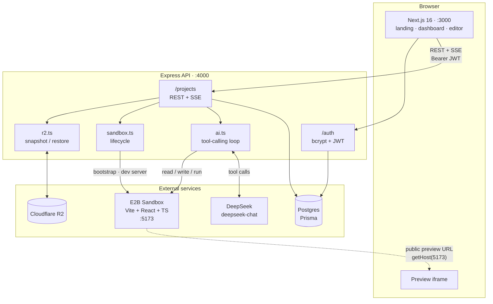
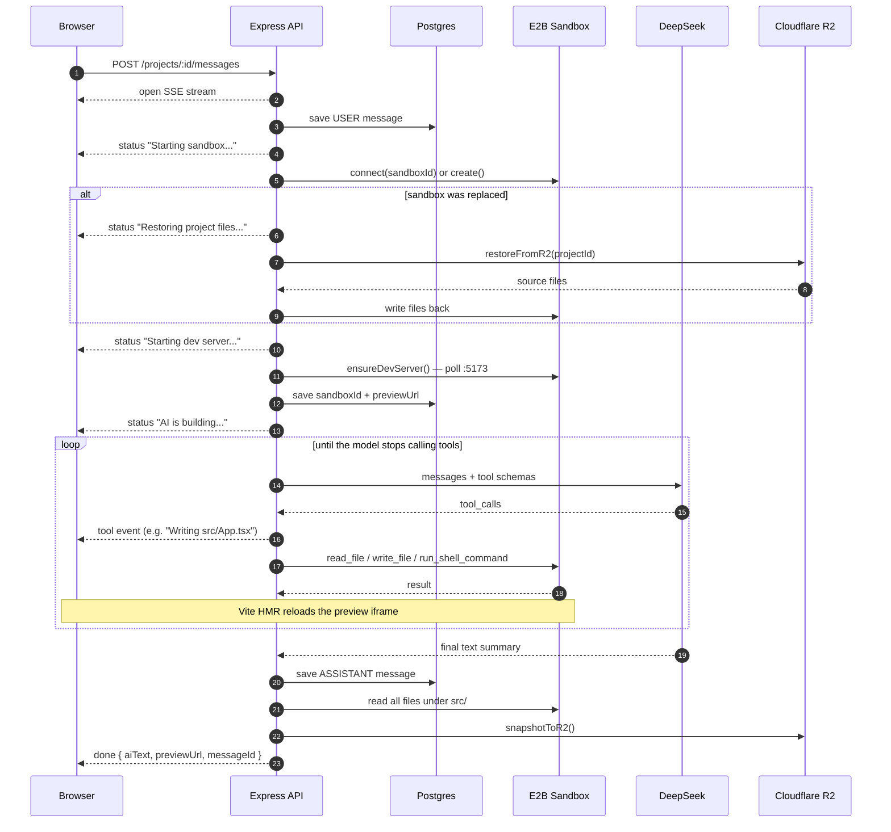
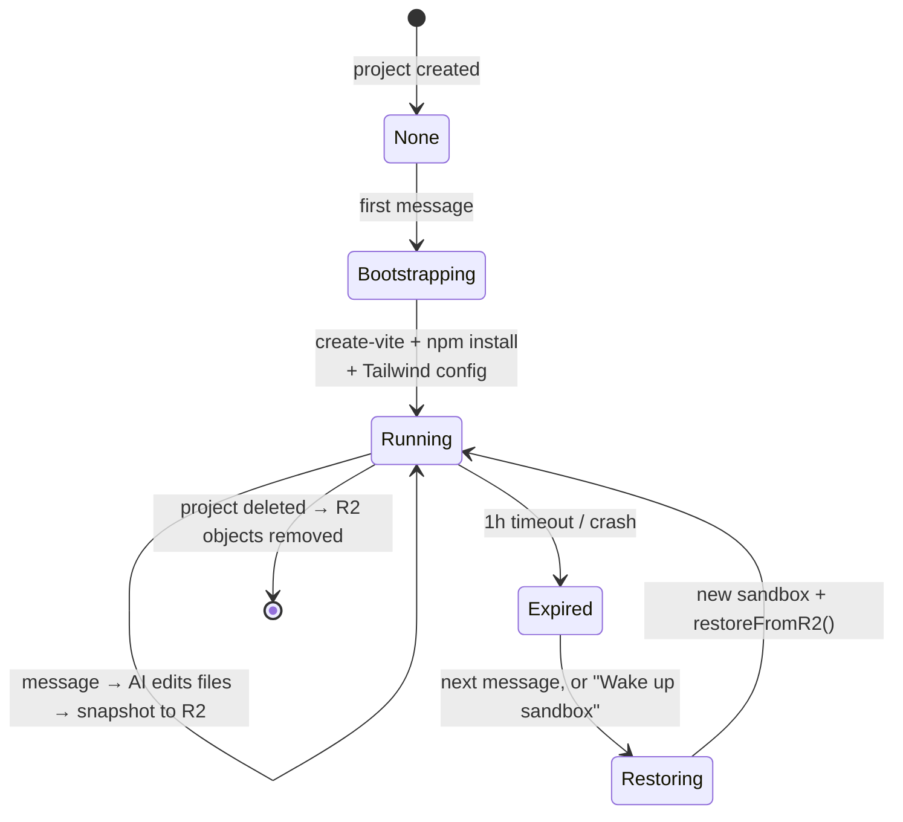
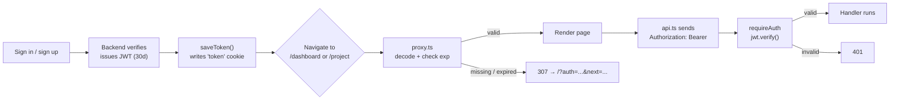
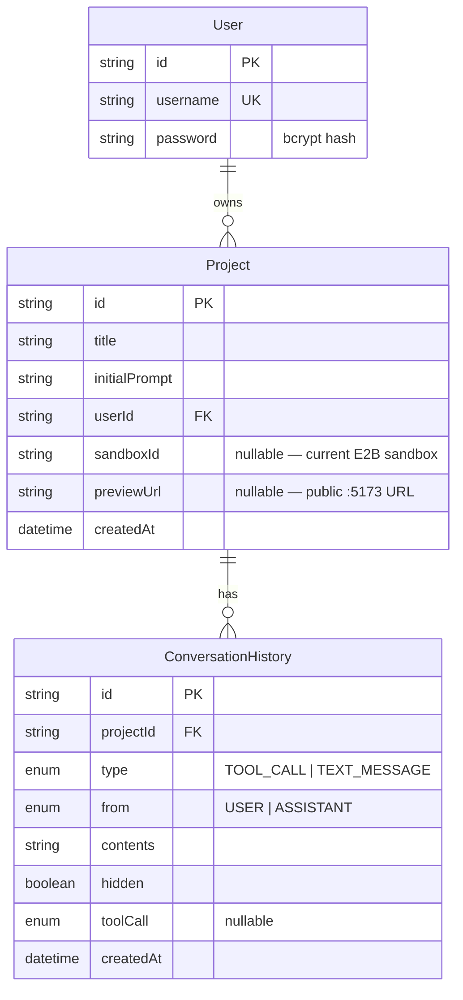

# Volt

Describe an app in plain English. Volt writes the code, runs it in an isolated cloud sandbox, and streams a live preview back to your browser.

A Lovable/Bolt-style "chat to app" builder. Each project gets its own [E2B](https://e2b.dev) sandbox running a Vite + React + TypeScript dev server; an LLM edits files inside it through tool calls, Vite's HMR picks up the changes, and the result renders in an iframe.

---

## Table of contents

- [How it works](#how-it-works)
- [Stack](#stack)
- [Architecture](#architecture)
- [Repository layout](#repository-layout)
- [The build loop](#the-build-loop)
- [Sandbox lifecycle and persistence](#sandbox-lifecycle-and-persistence)
- [Authentication](#authentication)
- [Data model](#data-model)
- [API reference](#api-reference)
- [Getting started](#getting-started)
- [Environment variables](#environment-variables)
- [Known limitations](#known-limitations)

---

## How it works

1. You type a prompt on the landing page and sign in.
2. A **Project** row is created; you land on `/project/:id`, which auto-sends your initial prompt as the first message.
3. The backend opens an **SSE stream**, boots (or reconnects to) an E2B sandbox, and starts the DeepSeek tool-calling loop.
4. The model calls `read_file` / `write_file` / `run_shell_command` against the sandbox until it has nothing left to do. Each call is streamed to the UI as a status line.
5. Vite HMR reloads the preview iframe as files land.
6. When the loop ends, source files are snapshotted to Cloudflare R2 and the preview URL is saved.

---

## Stack

| Layer | Choice | Notes |
|---|---|---|
| Monorepo | Turborepo + pnpm workspaces | `pnpm@11.0.3`, Node >= 20 |
| Frontend | Next.js 16, Tailwind v4, shadcn/ui | port **3000** |
| Backend | Express + TypeScript | port **4000** |
| LLM | DeepSeek `deepseek-chat` | via the OpenAI SDK against `api.deepseek.com` |
| Sandboxing | E2B | one sandbox per project, Vite on port **5173** |
| Database | Postgres via Prisma | |
| Object storage | Cloudflare R2 (S3-compatible) | source snapshots |

> **Note on Next.js 16:** Middleware was renamed to **Proxy**. Auth routing lives in `apps/web/proxy.ts`, not `middleware.ts`.

---

## Architecture



The browser talks only to the Express API. It never holds sandbox credentials, DeepSeek keys, or R2 keys — the only sandbox detail that reaches the client is the public preview URL.

---

## Repository layout

```
apps/
  web/                     Next.js frontend
    app/
      page.tsx             Landing page — prompt box, auth modal
      dashboard/           Project list, create + delete
      project/[projectId]/ Editor: chat sidebar, Preview/Code tabs
      (auth)/signin|signup Standalone auth pages
    lib/
      auth.ts              Session (cookie is the source of truth)
      token.ts             Runtime-agnostic JWT decode (client + proxy)
      api.ts               Fetch wrapper, attaches Bearer token
    proxy.ts               Next 16 Proxy — optimistic auth routing

  backend/                 Express API
    src/
      index.ts             App entry, CORS, route mounting
      routes/auth.ts       Signup / signin
      routes/project.ts    Project CRUD, files, sandbox, SSE messages
      lib/ai.ts            DeepSeek tool-calling loop
      lib/sandbox.ts       E2B lifecycle, bootstrap, dev server
      lib/r2.ts            R2 snapshot / restore
      middleware/auth.ts   requireAuth — verifies JWT

packages/
  db/                      Prisma schema, migrations, shared client
  shared-types/            Types shared across apps
```

---

## The build loop

The heart of the system. `POST /projects/:id/messages` holds an SSE connection open for the entire run.



### Tools available to the model

| Tool | Arguments | Purpose |
|---|---|---|
| `read_file` | `path` | Read a file from the sandbox |
| `write_file` | `path`, `content` | Create or overwrite a file |
| `run_shell_command` | `command` | Run a shell command (60s timeout) |

The system prompt scopes work to `/home/user/app`, states that Tailwind is preconfigured and the dev server is already running, forbids starting, stopping, or killing the dev server, and requires files be kept small enough to survive the model's output limit (see [Known limitations](#known-limitations)).

The loop is bounded by `MAX_STEPS` (40) and recovers from two failure modes rather than aborting the run: a response truncated by the token ceiling is discarded and retried with a request for smaller files, and a tool call whose `arguments` don't parse gets an error fed back as its tool result so the model can correct itself.

### SSE event types

```ts
| { type: "status"; text: string }
| { type: "tool";   name: string; detail: string }
| { type: "done";   aiText: string; previewUrl: string; messageId?: string }
```

Errors are delivered as a terminal `done` event with the message in `aiText` — so a failure appears in the chat transcript rather than breaking the stream.

---

## Sandbox lifecycle and persistence

Sandboxes are ephemeral (1-hour timeout); R2 is the durable store. A project's code survives sandbox death because every successful run snapshots it.



**Health and wake.** The editor polls `GET /projects/:id/sandbox/health` every 30s. When it reports dead, the preview is replaced by a "Sandbox is sleeping" panel with a wake button that calls `POST /projects/:id/sandbox/wake`, which recreates the sandbox, restores from R2, and returns a fresh preview URL.

**Storage layout.** One R2 object per file, not an archive:

```
projects/{projectId}/src/App.tsx
projects/{projectId}/src/components/Card.tsx
```

The Code tab reads from R2 rather than the sandbox, so you can browse a project's source even while its sandbox is asleep.

---

## Authentication

Username + password, bcrypt-hashed (cost 12), issuing a 30-day JWT.



Two checks, deliberately different in strength:

- **`apps/web/proxy.ts`** is an *optimistic* check. It decodes the JWT and checks `exp`, but does **not** verify the signature — `JWT_SECRET` belongs on the backend and must never reach the client bundle or the edge runtime. Next's own docs state that Proxy "should not be used as a full session management or authorization solution." Its only job is to avoid rendering pages you can't use.
- **`requireAuth`** on the Express API is the real security boundary. It calls `jwt.verify()` with the secret on every project route.

**The cookie is the single source of truth.** The proxy can only read cookies, so a session kept anywhere else would be invisible to it — the UI would show you signed in while every navigation bounced you back to `/`. `getToken()` migrates any legacy `localStorage` token into the cookie once, then removes the copy.

---

## Data model



`sandboxId` and `previewUrl` are rewritten on every run, since a replaced sandbox gets a new host.

---

## API reference

Base URL: `http://localhost:4000`. Every `/projects` route requires `Authorization: Bearer <jwt>`.

| Method | Path | Purpose |
|---|---|---|
| `GET` | `/health` | Liveness check — `{ ok: true }` |
| `POST` | `/auth/signup` | Create account → `{ token }` |
| `POST` | `/auth/signin` | Sign in → `{ token }` |
| `POST` | `/projects` | Create project from `{ title, initialPrompt }` |
| `GET` | `/projects` | List the caller's projects |
| `GET` | `/projects/:id` | Project + visible conversation history |
| `DELETE` | `/projects/:id` | Delete project, history, and R2 objects |
| `GET` | `/projects/:id/files` | List snapshotted file paths (from R2) |
| `GET` | `/projects/:id/file?path=` | Read one file's contents (from R2) |
| `GET` | `/projects/:id/sandbox/health` | `{ alive: boolean }` |
| `POST` | `/projects/:id/sandbox/wake` | Recreate + restore sandbox → `{ previewUrl }` |
| `POST` | `/projects/:id/messages` | **SSE** — run the build loop |

---

## Getting started

### Prerequisites

- Node >= 20 and pnpm 11 (`corepack enable`)
- A Postgres database
- API keys: [E2B](https://e2b.dev), [DeepSeek](https://platform.deepseek.com), and a Cloudflare R2 bucket

### Setup

```bash
pnpm install

cp apps/backend/.env.example apps/backend/.env
cp packages/db/.env.example  packages/db/.env
# then fill in both files — see Environment variables below

echo 'NEXT_PUBLIC_API_URL=http://localhost:4000' > apps/web/.env.local

pnpm db:generate    # prisma generate
pnpm db:migrate     # apply migrations
```

### Run

```bash
pnpm dev
```

Turbo starts both apps: the API on **:4000** and the web app on **:3000**. Open http://localhost:3000.

Confirm the backend came up — if it didn't, the UI still loads and every prompt fails:

```bash
curl localhost:4000/health   # expects {"ok":true}
```

Use `pnpm`, not `npm` — the repo pins `packageManager: pnpm@11.0.3`, and an `npm install` will corrupt the workspace links.

### Other commands

```bash
pnpm build          # build all workspaces
pnpm lint           # lint all workspaces
pnpm db:migrate     # prisma migrate dev
pnpm --filter @repo/db studio   # Prisma Studio
```

---

## Environment variables

**`apps/backend/.env`**

| Variable | Required | Description |
|---|---|---|
| `PORT` | no | API port, defaults to `4000` |
| `DATABASE_URL` | yes | Postgres connection string |
| `JWT_SECRET` | yes | Signing secret — backend only, never exposed to the client |
| `DEEPSEEK_API_KEY` | yes | DeepSeek API key |
| `E2B_API_KEY` | yes | E2B API key |
| `R2_ENDPOINT` | yes | R2 S3-compatible endpoint |
| `R2_ACCESS_KEY_ID` | yes | R2 access key |
| `R2_SECRET_ACCESS_KEY` | yes | R2 secret key |
| `R2_BUCKET` | yes | R2 bucket name |

**`packages/db/.env`** — `DATABASE_URL`, same value as the backend. Prisma CLI reads it from here.

**`apps/web/.env.local`** — `NEXT_PUBLIC_API_URL`, the browser-visible API base URL (`http://localhost:4000` in development).

---

## Known limitations

Honest list of things that will bite you, roughly in order of impact.

**Snapshots cover `src/` only.** `readAllSandboxFiles` walks `/home/user/app/src`, so `package.json` and `node_modules` are never persisted. The system prompt allows `npm install`, so if the model adds a dependency and the sandbox later expires, the restored `src/` will import a package the freshly bootstrapped sandbox doesn't have, and the preview breaks.

**The model cannot see its own past tool calls.** Conversation history is flattened to plain user/assistant text before being sent to DeepSeek, so tool calls and results are not replayed. On a follow-up message the model has to re-read files to learn what it previously wrote.

**Tool calls are never persisted.** The `TOOL_CALL` entry type, `ToolCallType` enum, and `hidden` flag exist in the schema but nothing writes them. Tool activity is streamed over SSE and lost on refresh.

**Generated files must stay small.** `deepseek-chat` caps completions at **8192 output tokens**, and that ceiling is not raisable — the API enforces it whether or not `max_tokens` is sent. A `write_file` call that exceeds it is cut off mid-string, leaving `arguments` as unparseable JSON. The system prompt therefore instructs the model to keep files under ~200 lines and split larger UIs across component files; the loop detects `finish_reason: "length"`, discards the truncated turn, and asks for smaller files (up to 3 times). Very large single-file requests can still fail.

**No token streaming.** The assistant's prose arrives in one piece in the terminal `done` event, not incrementally.

**Port conflicts fail silently.** `app.listen` has no `error` handler, so `EADDRINUSE` kills the backend inside Turbo's interleaved output with nothing obvious in the logs. If the UI loads but prompts fail, check `lsof -iTCP:4000 -sTCP:LISTEN` first.

**Not hardened for production.** CORS is fully open (`cors()` with no options), there is no rate limiting on auth or on the expensive `/messages` route, and sandbox cost is unbounded per user.

**Mixed package managers in history.** A stray `bun.lock` sits next to `pnpm-lock.yaml`. pnpm is authoritative; the bun lockfile is a leftover.
